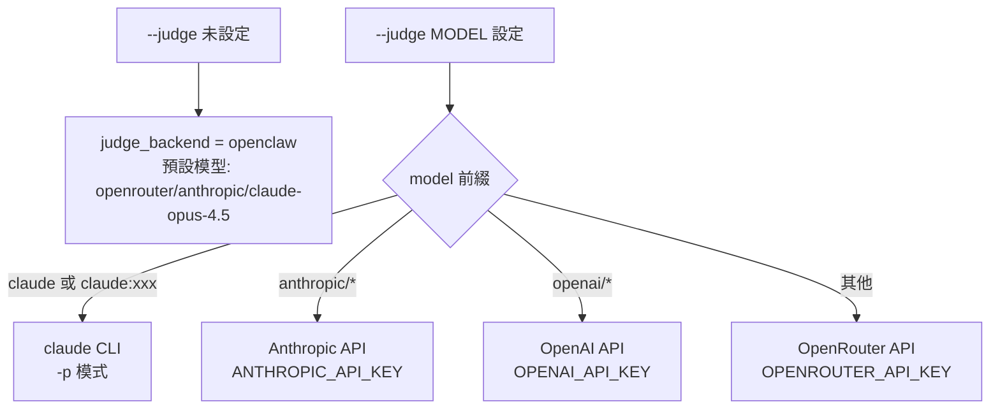

# API_SURFACE — API 與介面參考

## 1. CLI 命令參考

入口：`./scripts/run.sh [OPTIONS]` 或 `uv run scripts/benchmark.py [OPTIONS]`

| 參數 | 型別 | 預設值 | 說明 |
|------|------|--------|------|
| `--model MODEL` | str | 必填* | 模型 ID，需含 provider prefix，如 `openrouter/anthropic/claude-sonnet-4` |
| `--suite SUITE` | str | `all` | 任務集合：`all`、`automated-only`、或逗號分隔 task ID |
| `--output-dir DIR` | str | `results/` | 結果 JSON 儲存目錄 |
| `--runs N` | int | `1` | 每個任務執行次數（取平均） |
| `--timeout-multiplier N` | float | `1.0` | 縮放所有任務的 timeout |
| `--judge MODEL` | str | None | Judge 模型（設定後改用直接 API 呼叫） |
| `--base-url URL` | str | None | 自訂 OpenAI-compatible API endpoint |
| `--api-key KEY` | str | None | 自訂 endpoint 的 API key（預設用 `$OPENAI_API_KEY`） |
| `--no-upload` | flag | False | 跳過上傳到排行榜 |
| `--register` | flag | False | 申請 API token（單獨使用，不需 `--model`） |
| `--upload FILE` | str | None | 上傳既有結果 JSON（單獨使用） |
| `--official-key KEY` | str | None | 標記為官方提交（或用 `PINCHBENCH_OFFICIAL_KEY` env） |
| `--no-fail-fast` | flag | False | 即使 sanity task 得 0 分也繼續執行 |
| `--verbose` / `-v` | flag | False | 顯示詳細 log（transcript 內容、workspace 檔案等） |
| `--trend` | flag | False | 執行後進行趨勢分析 |
| `--trend-window N` | int | `10` | 趨勢分析的 run 窗口數（最少 2） |
| `--trend-threshold N` | float | `-0.5` | 回歸偵測門檻（%/run） |

*`--model` 僅在非 `--register` 和非 `--upload` 模式下必填。

### 使用範例

```bash
# 最基本執行
./scripts/run.sh --model openrouter/anthropic/claude-sonnet-4

# 只跑自動評分（較快）
./scripts/run.sh --model openrouter/anthropic/claude-sonnet-4 --suite automated-only

# 指定多個任務
./scripts/run.sh --model openrouter/openai/gpt-4o --suite task_calendar,task_stock,task_email

# 本地模型（ollama）
./scripts/run.sh --model my-model --base-url http://localhost:11434/v1 --no-upload

# 使用直接 API 作為 judge
./scripts/run.sh --model openrouter/openai/gpt-4o --judge anthropic/claude-sonnet-4-5-20250514

# 多次執行取平均，並分析趨勢
./scripts/run.sh --model openrouter/anthropic/claude-sonnet-4 --runs 3 --trend

# 申請 token 後正式提交
./scripts/run.sh --register
./scripts/run.sh --model openrouter/anthropic/claude-sonnet-4 --official-key pbk_...
```

---

## 2. 任務定義格式（YAML Frontmatter）

每個 `tasks/task_xxx.md` 的 YAML frontmatter 欄位：

| 欄位 | 型別 | 必填 | 預設值 | 說明 |
|------|------|------|--------|------|
| `id` | str | ✅ | - | 任務 ID，必須與檔名相符（去掉 `.md`） |
| `name` | str | ✅ | - | 人類可讀名稱 |
| `category` | str | ✅ | - | 分類（影響 fws 啟動：`gws`/`github` 自動啟動 fws） |
| `grading_type` | str | ✅ | - | `automated` / `llm_judge` / `hybrid` |
| `timeout_seconds` | int | ✅ | - | 任務執行超時秒數 |
| `workspace_files` | list | ❌ | `[]` | 預先複製到工作區的 fixture 檔案清單 |
| `grading_weights` | dict | ❌ | `{auto:0.5, llm:0.5}` | hybrid 評分權重（需合計為 1.0）|
| `sessions` | list | ❌ | - | multi-turn 對話的 prompt 列表 |
| `prerequisites` | list | ❌ | - | 外部依賴（如 `npm:@juppytt/fws`、`cli:gws`） |

### workspace_files 格式

```yaml
workspace_files:
  - source: assets/my_data.csv   # 相對於 skill root 的路徑
    dest: data.csv               # 相對於 workspace 的目標路徑
  - source: assets/images/img.jpg
    dest: images/photo.jpg
```

---

## 3. grade() 評分函式 API

在任務的 `## Automated Checks` section 中的 Python code block 定義：

### 函式簽名

```python
def grade(transcript: list, workspace_path: str) -> dict:
    """
    Args:
        transcript: JSONL transcript 的解析結果，List[Dict]
                   每個 Dict 代表一個 session event
        workspace_path: agent 執行任務後的工作區目錄絕對路徑（str）

    Returns:
        Dict[str, float]，key 為評分標準名稱，value 為 0.0~1.0 的分數
        最終分數 = 所有 value 的算術平均
    """
```

### Transcript Event 結構

```python
# Message event
{
    "type": "message",
    "message": {
        "role": "user" | "assistant" | "toolResult",
        "content": [...]  # 見下方各 role 說明
    }
}

# assistant role content items:
{"type": "text", "text": "..."}
{"type": "toolCall", "name": "tool_name", "arguments": {...}}

# toolResult role content items:
[{"type": "text", "text": "tool output..."}]

# usage (在 assistant message 中)
"usage": {
    "input": 1200,
    "output": 340,
    "cacheRead": 0,
    "cacheWrite": 0,
    "totalTokens": 1540,
    "cost": {"total": 0.00123}
}
```

### 常見 grade() 模式

```python
def grade(transcript: list, workspace_path: str) -> dict:
    from pathlib import Path
    import re, json

    scores = {}
    workspace = Path(workspace_path)

    # 1. 檢查檔案是否存在
    scores["file_created"] = 1.0 if (workspace / "output.txt").exists() else 0.0

    # 2. 檢查工具呼叫
    for event in transcript:
        if event.get("type") != "message":
            continue
        msg = event.get("message", {})
        if msg.get("role") == "assistant":
            for item in msg.get("content", []):
                if item.get("type") == "toolCall":
                    if item.get("name") == "create_event":
                        scores["tool_used"] = 1.0

    # 3. 檢查檔案內容
    output_file = workspace / "report.md"
    if output_file.exists():
        content = output_file.read_text()
        scores["has_priority"] = 1.0 if re.search(r"P[0-3]", content) else 0.0

    return scores  # 所有 value 的算術平均 = 最終分數
```

**注意**：函式在 isolated namespace 中以 `exec()` 執行（`lib_grading.py:117`）。唯一注入的變數是 `_PINCHBENCH_PRIVATE_IMAGE_KEY_PATH`（圖片分類任務用）。

---

## 4. Judge 後端選擇



| judge 值 | 後端 | 需要的 env var |
|---------|------|--------------|
| 未設定 | OpenClaw agent session | `OPENROUTER_API_KEY` |
| `openrouter/anthropic/claude-opus-4.5` | OpenRouter HTTP | `OPENROUTER_API_KEY` |
| `anthropic/claude-sonnet-4-5-20250514` | Anthropic API | `ANTHROPIC_API_KEY` |
| `openai/gpt-4o` | OpenAI API | `OPENAI_API_KEY` |
| `claude` | `claude -p` CLI | claude CLI 已安裝 |
| `claude:claude-opus-4-5` | `claude -p --model ...` | claude CLI 已安裝 |

---

## 5. 環境變數參考

| 變數 | 必要性 | 說明 |
|------|--------|------|
| `OPENROUTER_API_KEY` | 強烈建議 | 模型驗證 + OpenRouter judge |
| `ANTHROPIC_API_KEY` | anthropic judge 時必填 | 直接呼叫 Anthropic API |
| `OPENAI_API_KEY` | openai judge 或自訂 endpoint 時 | OpenAI API 或 `--base-url` 預設 key |
| `PINCHBENCH_TOKEN` | 上傳排行榜時必填 | 來自 `--register` 流程 |
| `PINCHBENCH_OFFICIAL_KEY` | 官方提交時 | 等同 `--official-key` flag |
| `PINCHBENCH_SERVER_URL` | 可選 | 覆蓋 API server（預設 `https://api.pinchbench.com`） |
| `PINCHBENCH_MAX_MSG_CHARS` | 可選 | 單次 message 最大字元（預設 `8000`） |
| `PINCHBENCH_JUDGE_MAX_MSG_CHARS` | 可選 | Judge message 最大字元（預設 `3000`，超過分段傳送） |
| `OPENCLAW_PATH` | 可選 | openclaw CLI 路徑（預設 `openclaw`） |
| `NO_COLOR` | 可選 | 停用 ANSI 色彩輸出 |

---

## 6. PinchBench API Endpoints

### 6.1 Token 申請

```
POST https://api.pinchbench.com/api/register
Content-Type: application/json
User-Agent: PinchBench/{version}

Request body: {}

Response:
{
  "token": "pbk_xxxxxxxxxxxxxxxx",
  "claim_url": "https://pinchbench.com/claim?token=..."  // optional
}
```

### 6.2 結果上傳

```
POST https://api.pinchbench.com/api/results
Content-Type: application/json
X-PinchBench-Token: {token}
X-PinchBench-Version: {client_version}
X-PinchBench-Official-Key: {key}  // optional

Request body: 見結果 JSON 格式（DATA_MODEL.md）

Response:
{
  "status": "accepted",
  "submission_id": "uuid",
  "rank": 5,              // optional
  "percentile": 92.3,     // optional
  "leaderboard_url": "https://pinchbench.com/..."  // optional
}
```

---

## 7. 結果 JSON 格式（輸出檔）

輸出到 `{output_dir}/{run_id}_{model_slug}.json`：

```json
{
  "model": "openrouter/anthropic/claude-sonnet-4",
  "benchmark_version": "2.0.1",
  "run_id": "0001",
  "timestamp": 1745123456.789,
  "suite": "all",
  "runs_per_task": 1,
  "tasks": [
    {
      "task_id": "task_calendar",
      "status": "success | timeout | error",
      "timed_out": false,
      "execution_time": 45.2,
      "transcript_length": 12,
      "usage": {
        "input_tokens": 1200,
        "output_tokens": 340,
        "total_tokens": 1540,
        "cost_usd": 0.00123,
        "request_count": 3
      },
      "workspace": "/tmp/pinchbench/0001-1/...",
      "grading": {
        "runs": [{"score": 0.833, "breakdown": {...}, ...}],
        "mean": 0.833,
        "std": 0.0,
        "min": 0.833,
        "max": 0.833
      },
      "frontmatter": { ... }
    }
  ],
  "efficiency": {
    "total_tokens": 45000,
    "total_cost_usd": 0.045,
    "score_per_1k_tokens": 0.541,
    "score_per_dollar": 1250.0,
    "per_task": [...]
  }
}
```
