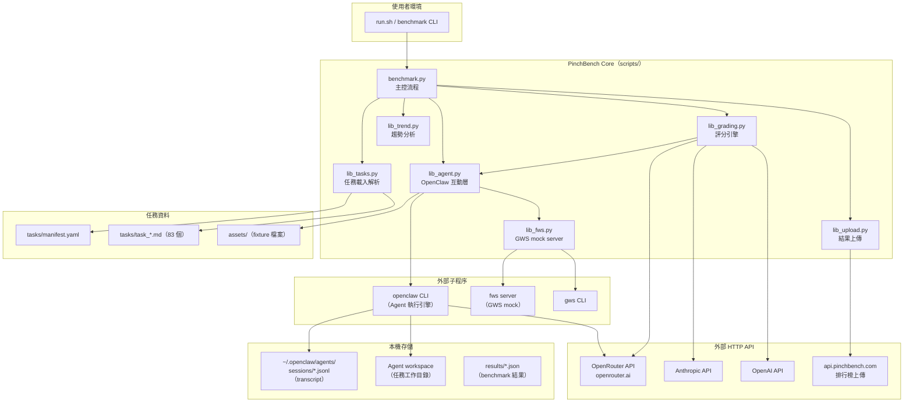
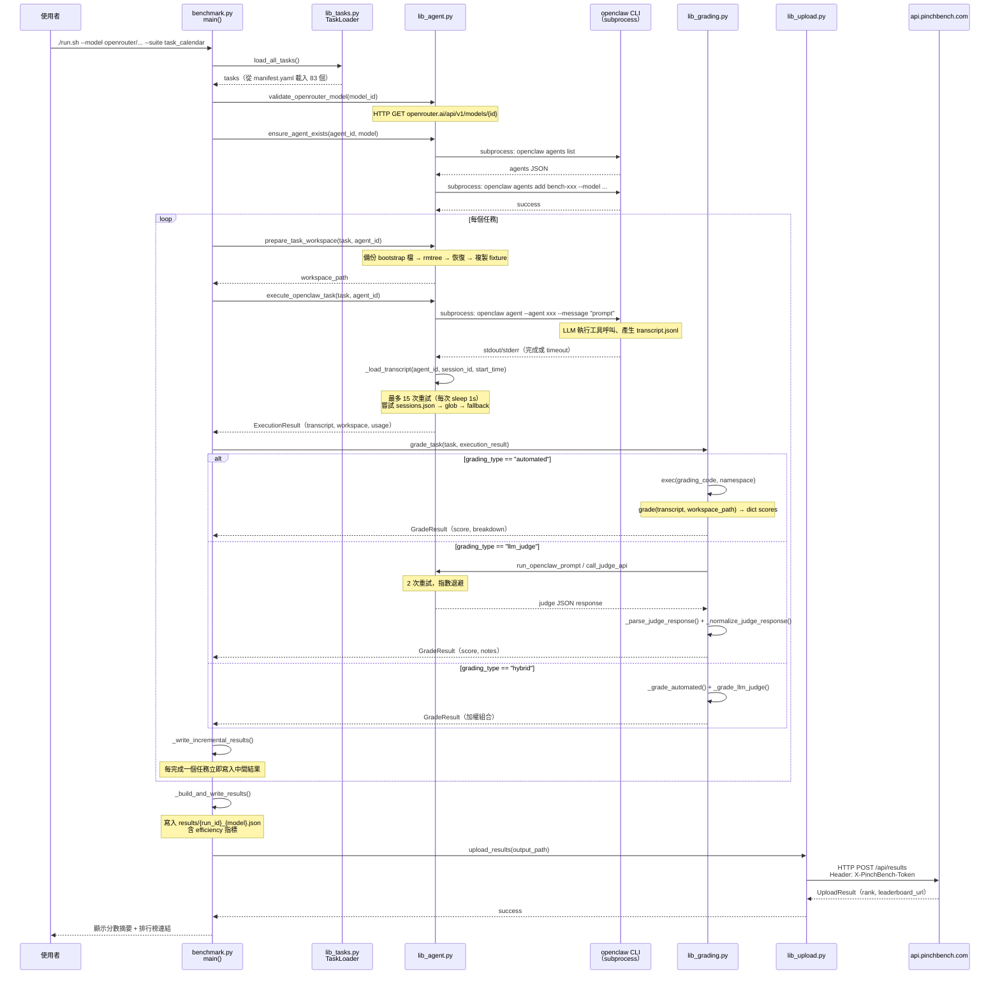

# PinchBench 系統架構文件

> 版本：2.0.0-rc1 ｜ 更新日期：2026-04-21

---

## 1. 高層架構

PinchBench 是一套**純 CLI benchmark 工具**，以 Python 撰寫，無 web server、無 ORM、無 message queue。所有邏輯集中在 `scripts/` 下的 monolith 結構中。系統的核心工作是：驅動外部 `openclaw` agent CLI 執行真實任務，收集 transcript，再對結果評分並上傳排行榜。



---

## 2. 元件清單

| 元件 | 職責 | 關鍵檔案 | 上游依賴 | 下游依賴 |
|------|------|----------|----------|----------|
| **benchmark.py** | 主控流程：參數解析、任務迴圈、結果聚合 | `scripts/benchmark.py`（927 行） | CLI args | lib_agent, lib_grading, lib_tasks, lib_upload, lib_trend |
| **lib_agent.py** | OpenClaw subprocess 呼叫、workspace 準備、transcript 發現 | `scripts/lib_agent.py`（1242 行） | benchmark.py | openclaw CLI, fws, 外部 LLM API |
| **lib_grading.py** | 三種評分模式（automated / llm_judge / hybrid）、結果正規化 | `scripts/lib_grading.py`（717 行） | benchmark.py | lib_agent（judge 呼叫）, LLM API |
| **lib_tasks.py** | 任務 Markdown 解析、manifest 載入、Task dataclass | `scripts/lib_tasks.py`（219 行） | benchmark.py | tasks/manifest.yaml, tasks/*.md |
| **lib_upload.py** | PinchBench API token 管理、結果上傳 | `scripts/lib_upload.py`（434 行） | benchmark.py | api.pinchbench.com |
| **lib_fws.py** | GWS mock server 生命週期（start / stop / env 設定） | `scripts/lib_fws.py`（105 行） | lib_agent.py | fws CLI subprocess |
| **lib_trend.py** | 多次 run 結果的線性回歸趨勢偵測 | `scripts/lib_trend.py`（177 行） | benchmark.py | Python stdlib statistics |
| **tasks/manifest.yaml** | 任務有序清單（唯一真實來源） | `tasks/manifest.yaml` | — | lib_tasks.py |
| **tasks/task_*.md** | 83 個任務定義（Markdown + YAML frontmatter + Python grading code） | `tasks/task_*.md` | manifest.yaml | lib_tasks.py, lib_grading.py |
| **assets/** | 任務 fixture 資料（CSV、圖片、PDF、log 等） | `assets/`（子目錄） | — | lib_agent.py（workspace 複製） |
| **openclaw CLI** | LLM agent 執行引擎（外部相依，不含在此 repo） | 系統 PATH | lib_agent.py | OpenRouter / 其他 LLM provider |

---

## 3. 分層設計說明

系統採用**三層架構**，各層職責明確：

```
┌─────────────────────────────────────────────────────┐
│  入口層（Entry Layer）                               │
│  scripts/run.sh → benchmark.py:main()               │
│  負責：CLI 解析、啟動序列、任務迴圈控制、結果輸出  │
├─────────────────────────────────────────────────────┤
│  業務層（Domain Layer）                             │
│  lib_tasks.py  lib_grading.py  lib_trend.py        │
│  負責：任務解析、評分邏輯、趨勢分析                │
├─────────────────────────────────────────────────────┤
│  整合層（Integration Layer）                        │
│  lib_agent.py  lib_fws.py  lib_upload.py           │
│  負責：subprocess 管理、外部 API 呼叫、本機存儲    │
└─────────────────────────────────────────────────────┘
```

### 各層詳述

**入口層**（`benchmark.py`）

- `main()` at line 589 是唯一入口點
- 執行 5 秒啟動延遲 + ASCII art（`crab.txt`）
- 處理兩種特殊模式：`--register`（申請 token）、`--upload`（上傳既有結果）
- `task_sanity` fail-fast 機制：若 sanity 任務得分為 0 且有 transcript，立即 `sys.exit(3)` 節省資源

**業務層**（`lib_tasks.py`, `lib_grading.py`, `lib_trend.py`）

- `TaskLoader` 先找 `manifest.yaml`，不存在則 glob `task_*.md`（防呆設計）
- 評分引擎(`lib_grading.py`) 的 `GradeResult` dataclass 是跨層傳遞的核心資料結構
- 趨勢分析使用 Python 3.10+ stdlib `statistics.linear_regression`，不引入額外相依

**整合層**（`lib_agent.py`, `lib_fws.py`, `lib_upload.py`）

- 所有外部通訊集中在此層，上層不直接呼叫 subprocess 或 HTTP
- `lib_agent.py` 是最重的元件（1242 行），承擔 OpenClaw 管理、workspace 準備、transcript 發現的全部複雜度

---

## 4. 通訊模式

| 通訊模式 | 使用場景 | 具體位置 |
|----------|----------|----------|
| **subprocess（blocking）** | 執行 `openclaw agent` 任務 | `lib_agent.py:840`，帶 `timeout` 限制 |
| **subprocess（blocking）** | 管理 `openclaw agents list/add/delete` | `lib_agent.py:304–364` |
| **subprocess（blocking）** | 管理 `fws server start/stop` | `lib_fws.py:38–80` |
| **HTTP GET（urllib）** | 驗證模型是否存在於 OpenRouter | `benchmark.py`，呼叫 `validate_openrouter_model()` |
| **HTTP POST（urllib）** | 上傳 benchmark 結果到排行榜 | `lib_upload.py:74`，endpoint: `api.pinchbench.com/api/results` |
| **HTTP（Anthropic SDK）** | LLM judge 直接呼叫 Anthropic | `lib_agent.py:_judge_via_anthropic()`，`--judge anthropic/...` 時啟用 |
| **HTTP（OpenAI SDK）** | LLM judge 直接呼叫 OpenAI | `lib_agent.py:_judge_via_openai()`，`--judge openai/...` 時啟用 |
| **HTTP（OpenRouter）** | LLM judge 透過 OpenRouter 呼叫 | `lib_agent.py:_judge_via_openrouter()`，預設 judge 路由 |
| **直接檔案 I/O** | Transcript JSONL 讀取、workspace 檔案操作 | `lib_agent.py:_load_transcript()`、`prepare_task_workspace()` |

**通訊原則**：任務執行（agent 呼叫）一律透過 subprocess，確保 OpenClaw 擁有獨立的程序環境與工作目錄；judge 評分則依 model prefix 動態路由至對應 HTTP 後端。

---

## 5. 關鍵設計決策與 Trade-off

### 5.1 為何用 `exec()` 執行 grading code

**決策**：每個任務在 Markdown 的 "Automated Checks" section 嵌入 Python code block，benchmark 在執行時用 `exec()` 動態執行（`lib_grading.py:99`）。

**理由**：
- 讓任務定義自包含（self-contained），新增任務不需修改任何核心程式碼
- 評分邏輯可任意複雜（正則、檔案解析、diff 比對等），不受 YAML schema 限制

**Trade-off**：
- 安全性風險：惡意任務定義可執行任意程式碼（`namespace` 隔離有限，僅注入少數變數）
- 難以靜態分析與 IDE 支援
- 執行環境僅注入 `_PINCHBENCH_PRIVATE_IMAGE_KEY_PATH`，其餘 stdlib 均可使用

### 5.2 Transcript 發現的 15 次重試策略

**問題**：OpenClaw CLI 忽略我們傳入的 `--session-id`，自行生成 UUID-based session ID，因此無法預知 transcript 存在的路徑（`lib_agent.py:588` 的注解說明此問題）。

**解決策略**（`_load_transcript` at `lib_agent.py:601`）：
1. 讀取 `sessions.json` 解析真實 session UUID
2. 嘗試多種候選路徑（`.jsonl`, `.ndjson`, `transcript.jsonl`, `events.jsonl`）
3. Glob `sessions/` 下所有 `.jsonl`，取 mtime >= 任務開始時間 - 5s 的最新檔案
4. 以傳入的 session_id 直接嘗試（最後手段）
5. 每次失敗 sleep 1 秒，最多 15 次

**理由**：OpenClaw 寫入 transcript 有延遲（非同步 flush），輪詢是目前最可靠的跨版本相容做法。

**Trade-off**：最壞情況下增加 15 秒延遲；若 OpenClaw 未來修正此行為，重試邏輯可大幅簡化。

### 5.3 Judge 使用 OpenClaw session vs. 直接 API

**預設模式（judge_backend="openclaw"）**：透過 `run_openclaw_prompt()` 以 agent session 執行 judge，繼承 OpenClaw 的工具與 context 管理。

**`--judge` flag 模式（judge_backend="api"）**：直接呼叫 LLM API（`call_judge_api` at `lib_agent.py:1075`），依 model prefix dispatch：
- `claude:` / `claude` → Claude CLI
- `anthropic/` → Anthropic SDK
- `openai/` → OpenAI SDK
- 其他 → OpenRouter

**Trade-off**：直接 API 模式更快、成本更低，但失去 OpenClaw 的 context 管理；預設的 openclaw 模式行為更一致，便於除錯。

### 5.4 fail-fast 機制（task_sanity）

`task_sanity` 排在 manifest 第一位，若得分為 0 且 transcript 非空，立即 `sys.exit(3)`。

**理由**：task_sanity 是最簡單的 sanity check，若連它都失敗，後續 83 個任務大概率也會失敗，提前終止可節省大量 API 費用與時間。

**Trade-off**：若 agent 環境異常（而非模型能力問題），可能誤判；`--no-fail-fast` flag 可覆蓋此行為。

### 5.5 效率指標（score_per_dollar, score_per_1k_tokens）

PinchBench 不只報告分數，還計算每美元與每千 token 的分數（`benchmark.py:405`），作為差異化指標，讓使用者評估 cost-performance trade-off。

---

## 6. Sequence Diagram：典型任務執行流程



---

## 附錄：環境變數速查

| 環境變數 | 預設值 | 說明 | 定義位置 |
|----------|--------|------|----------|
| `PINCHBENCH_MAX_MSG_CHARS` | `8000` | 單次 openclaw message 最大字元數 | `lib_agent.py:33` |
| `PINCHBENCH_JUDGE_MAX_MSG_CHARS` | `3000` | judge 訊息最大字元數 | `lib_agent.py:34` |
| `OPENCLAW_PATH` | `openclaw` | openclaw CLI 路徑 | `lib_agent.py:1002` |
| `PINCHBENCH_SERVER_URL` | `https://api.pinchbench.com` | 自訂 API server | `lib_upload.py:64` |
| `PINCHBENCH_TOKEN` | — | 排行榜認證 token | `lib_upload.py:65` |
| `PINCHBENCH_OFFICIAL_KEY` | — | 標記官方提交 | `lib_upload.py:66` |
| `OPENAI_API_KEY` | — | 自訂 endpoint 認證（`--base-url` 時） | `lib_agent.py` |
