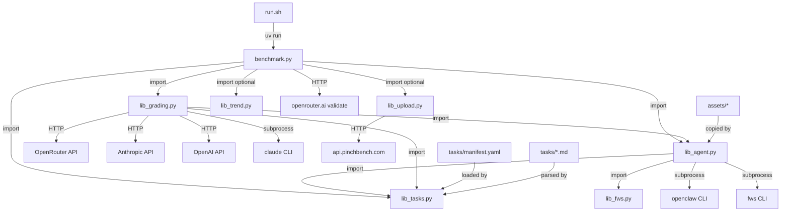
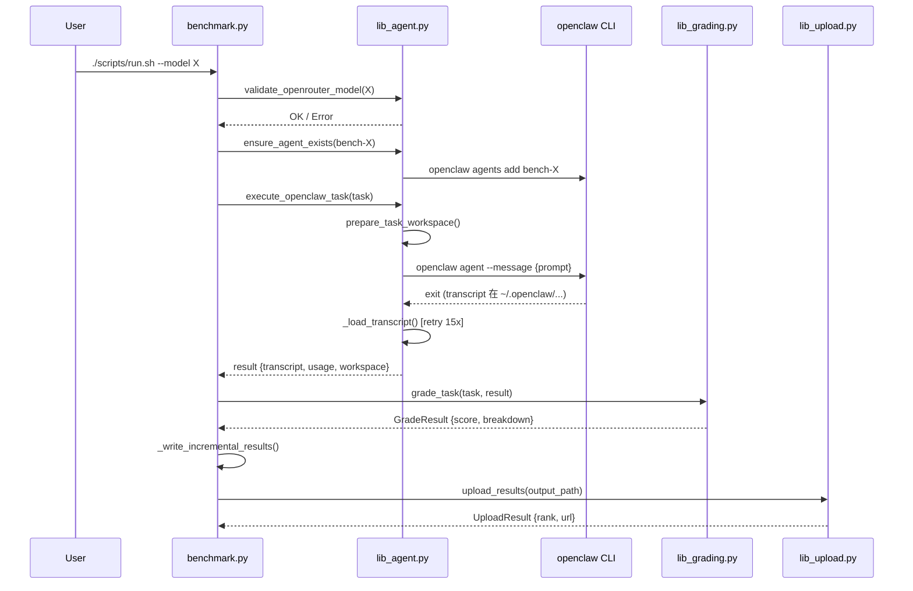

# CODEBASE_MAP — 程式碼地圖

## Annotated Directory Tree

```
pinchbench-skill/
│
├── scripts/                    ★ 核心程式碼（所有業務邏輯）
│   ├── benchmark.py            主入口，協調整個 benchmark 流程（927 行）
│   ├── lib_agent.py            OpenClaw CLI 互動層：agent 管理、任務執行、transcript 載入（1242 行）
│   ├── lib_tasks.py            任務載入與解析：Markdown→Task 物件（219 行）
│   ├── lib_grading.py          評分引擎：automated / LLM judge / hybrid（717 行）
│   ├── lib_upload.py           結果上傳至 api.pinchbench.com + token 管理（434 行）
│   ├── lib_fws.py              fws mock server 生命週期管理（105 行）
│   ├── lib_trend.py            趨勢分析：OLS 回歸偵測分數回歸（177 行）
│   ├── lint_argparse_help.py   CI lint：確保 argparse help string 不含 %（75 行）
│   ├── lint_manifest.py        CI lint：manifest.yaml 與 task 檔案一致性驗證（85 行）
│   └── run.sh                  uv wrapper（執行進入點）
│
├── tasks/                      ★ 83 個 benchmark 任務定義
│   ├── manifest.yaml           任務有序清單（唯一真實來源）
│   ├── TASK_TEMPLATE.md        新任務撰寫模板
│   └── task_*.md               各任務定義（81 個）
│       ├── task_sanity.md      基礎健全性測試（永遠第一個跑，失敗則 fail-fast）
│       ├── task_calendar.md    行事曆事件建立（automated）
│       ├── task_gws_*.md       Google Workspace 任務（需要 fws + gws CLI）
│       ├── task_csv_*.md       CSV 資料分析任務（多個）
│       ├── task_meeting_*.md   會議逐字稿分析任務（多個）
│       └── ...
│
├── assets/                     任務 fixture 檔案
│   ├── csvs/                   CSV 資料集（8 個）：氣溫、GDP、生命預期、股票等
│   ├── images/                 圖片 fixture（圖片辨識任務用）
│   ├── meetings/               會議逐字稿（4 個 Markdown）
│   ├── logs/                   Log 檔案（4 個：Apache、Hadoop、Linux syslog）
│   ├── refactor/               程式碼重構任務 fixture
│   ├── order_processor.py      訂單處理程式（程式碼任務用）
│   ├── form.html               HTML 表單（前端任務用）
│   ├── quarterly_sales.csv     季度銷售資料
│   ├── company_expenses.xlsx   公司費用 Excel
│   ├── sample_contract.pdf     合約範本 PDF
│   ├── school-calendar.pdf     學校行事曆 PDF
│   ├── broken_k8s_deployment.yml  K8s 除錯任務用
│   ├── broken_ci.yml           CI/CD 除錯任務用
│   ├── dashboard_component.html   前端元件任務用
│   ├── dashboard_tests.py      測試生成任務用
│   ├── image_classification_answer_key.json  圖片分類答案（私密）
│   └── cncf-tag-runtime-notes.md  CNCF 技術文件（摘要任務用）
│
├── tests/                      Python 單元測試
│   ├── test_lib_grading.py     評分邏輯測試（normalize、hybrid combine）
│   └── test_lib_trend.py       趨勢分析測試（OLS、regression detection）
│
├── .github/
│   ├── benchmark-models.yml    預設測試模型清單（35 個模型）
│   └── workflows/
│       ├── lint.yml            PR + main push 時：ruff + lint_argparse + lint_manifest
│       ├── release.yml         版本發布流程
│       └── update-task-count.yml  自動更新 README 中的任務數量 badge
│
├── pyproject.toml              專案依賴、setuptools 配置、pytest/ruff/black 設定
├── SKILL.md                    OpenClaw skill manifest（YAML frontmatter + 文件）
├── README.md                   公開說明文件
├── BENCHMARK_VERSION           Build 版本號
├── Dockerfile.benchmark        容器化執行環境
├── crab.txt                    ASCII art（啟動畫面彩色漸層用）
└── .pre-commit-config.yaml     Pre-commit hooks（ruff）
```

---

## 「我想改 X 要看哪裡？」速查表

| 我想要... | 看這裡 | 關鍵檔案 |
|-----------|--------|---------|
| 新增一個 benchmark 任務 | `tasks/` + `tasks/manifest.yaml` | `TASK_TEMPLATE.md`, `manifest.yaml` |
| 修改任務評分邏輯 | 對應任務的 `## Automated Checks` section | `tasks/task_xxx.md` |
| 修改評分引擎核心 | `scripts/lib_grading.py` | `grade_task()`, `_grade_automated()` |
| 新增 judge 後端 | `scripts/lib_agent.py` | `call_judge_api()` at line 1075 |
| 調整 agent 建立邏輯 | `scripts/lib_agent.py` | `ensure_agent_exists()` at line 201 |
| 新增 CLI 參數 | `scripts/benchmark.py` | `_parse_args()` at line 174 |
| 修改上傳格式 | `scripts/lib_upload.py` | `_build_payload()` at line 176 |
| 新增 fixture 檔案 | `assets/` | 更新任務 `workspace_files` frontmatter |
| 調整排行榜 server URL | 環境變數 | `PINCHBENCH_SERVER_URL` |
| 新增 GWS/GitHub mock 支援 | `scripts/lib_fws.py` | `is_fws_task()`, `start_fws()` |
| 調整趨勢分析參數 | `scripts/lib_trend.py` | `RunTrendAnalyzer.__init__()` |
| 修改 agent 配置邏輯 | `scripts/lib_agent.py` | `ensure_agent_exists()` at line 303 |
| 新增預設測試模型 | `.github/benchmark-models.yml` | `models:` 清單 |
| 調整 benchmark 版本號 | `BENCHMARK_VERSION` 或 git tag | - |

---

## 模組依賴關係圖



---

## 執行時資料流向圖


