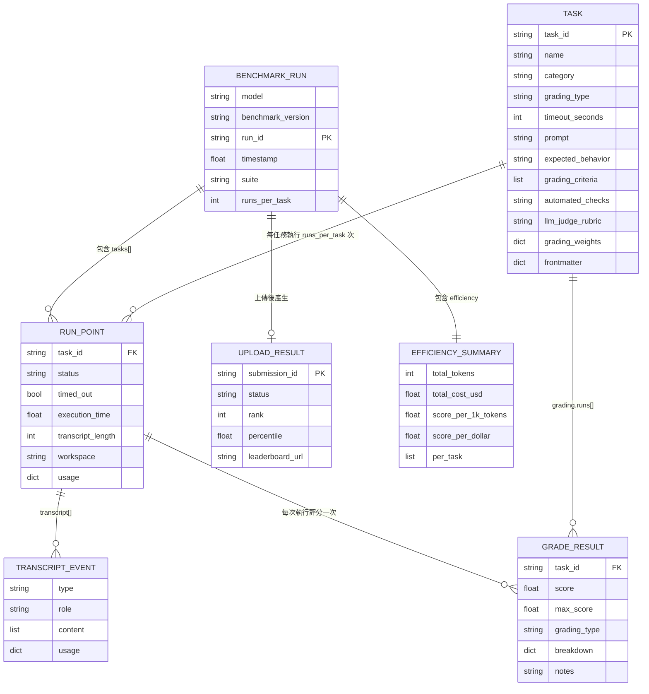

# PinchBench 資料模型文件

> 版本：2.0.0-rc1｜更新日期：2026-04-21

---

## 目錄

1. [核心 Entity 清單](#1-核心-entity-清單)
2. [任務定義格式（Markdown frontmatter）](#2-任務定義格式markdown-frontmatter)
3. [結果 JSON 格式](#3-結果-json-格式)
4. [Transcript 格式（JSONL）](#4-transcript-格式jsonl)
5. [評分資料結構](#5-評分資料結構)
6. [效率指標計算](#6-效率指標計算)
7. [ER Diagram](#7-er-diagram)

---

## 1. 核心 Entity 清單

### 1.1 Task

定義於 `scripts/lib_tasks.py:19`，代表單一 benchmark 任務。

| 欄位 | 型別 | 說明 |
|------|------|------|
| `task_id` | `str` | 任務唯一識別碼，如 `task_calendar` |
| `name` | `str` | 人類可讀名稱，如 `"Calendar Event Creation"` |
| `category` | `str` | 任務分類，如 `calendar`、`gws`、`github` |
| `grading_type` | `str` | 評分模式：`automated`、`llm_judge`、`hybrid` |
| `timeout_seconds` | `int` | 任務超時秒數（預設 120） |
| `workspace_files` | `List[Dict[str, str]]` | 需複製到工作區的 fixture 清單，含 `source`/`dest` |
| `prompt` | `str` | 傳給 agent 的任務指令文字 |
| `expected_behavior` | `str` | 理想行為描述（用於 LLM judge） |
| `grading_criteria` | `List[str]` | 從 checklist 提取的評分條件清單 |
| `automated_checks` | `Optional[str]` | "Automated Checks" 區段原始文字（含 ```python 包裹） |
| `llm_judge_rubric` | `Optional[str]` | LLM judge 使用的評分標準 Markdown |
| `grading_weights` | `Optional[Dict[str, float]]` | hybrid 模式的權重，如 `{"automated": 0.5, "llm_judge": 0.5}` |
| `file_path` | `Optional[Path]` | 任務 `.md` 檔案的絕對路徑 |
| `frontmatter` | `Dict[str, Any]` | 原始 YAML frontmatter（含全部欄位） |

### 1.2 GradeResult

定義於 `scripts/lib_grading.py:29`（`@dataclass`），代表單次評分結果。

| 欄位 | 型別 | 說明 |
|------|------|------|
| `task_id` | `str` | 對應的任務 ID |
| `score` | `float` | 最終分數，範圍 0.0–1.0 |
| `max_score` | `float` | 最大可能分數，固定為 `1.0` |
| `grading_type` | `str` | 實際使用的評分模式：`automated`、`llm_judge`、`hybrid` |
| `breakdown` | `Dict[str, float]` | 各評分標準的細項分數（詳見第 5 節） |
| `notes` | `str` | 評分備註或錯誤說明 |

### 1.3 RunPoint（執行結果 dict）

執行後由 `lib_agent.py` 回傳的 dict，未定義為正式 dataclass，
結構如下（`benchmark.py:856–868` 組裝為 task entry）：

| 欄位 | 型別 | 說明 |
|------|------|------|
| `task_id` | `str` | 任務 ID |
| `status` | `str` | `"success"`、`"timeout"`、`"error"` |
| `timed_out` | `bool` | 是否超時 |
| `execution_time` | `float` | 執行耗時（秒） |
| `transcript_length` | `int` | Transcript 的 event 數量 |
| `transcript` | `List[Dict]` | JSONL 解析後的 event 列表 |
| `workspace` | `str` | 工作區絕對路徑，如 `/tmp/pinchbench/0001-1/.../workspace` |
| `usage` | `Dict[str, Any]` | Token 使用量（input/output/total/cost） |

### 1.4 UploadResult

定義於 `scripts/lib_upload.py:26`（`@dataclass`），代表上傳排行榜的結果。

| 欄位 | 型別 | 說明 |
|------|------|------|
| `status` | `str` | `"accepted"`、`"dry_run"` 等伺服器回應狀態 |
| `submission_id` | `str` | UUID v4，本機生成或伺服器回傳 |
| `rank` | `Optional[int]` | 在排行榜上的排名（伺服器回傳） |
| `percentile` | `Optional[float]` | 百分位數（伺服器回傳） |
| `leaderboard_url` | `Optional[str]` | 本次提交的排行榜 URL |

---

## 2. 任務定義格式（Markdown frontmatter）

每個任務定義為一個 Markdown 檔案（`tasks/task_*.md`），以 YAML frontmatter 開頭。

### 完整欄位規格

```yaml
---
# === 必填欄位 ===
id: task_calendar                  # str  任務唯一 ID（必須與檔名一致）
name: Calendar Event Creation      # str  人類可讀名稱
category: calendar                 # str  分類（calendar/gws/github/coding 等）
grading_type: automated            # str  評分模式：automated | llm_judge | hybrid

# === 選填欄位（有預設值）===
timeout_seconds: 120               # int  超時秒數（預設 120）
workspace_files: []                # list fixture 清單（預設空清單）

# === 選填欄位（無預設值）===
grading_weights:                   # dict hybrid 評分權重（grading_type=hybrid 時使用）
  automated: 0.5
  llm_judge: 0.5

sessions:                          # list 多輪對話（每個元素為一段 prompt 文字）
  - "Session 1 的指令..."
  - "Session 2 的指令..."

prerequisites:                     # list 前置依賴（如 npm 套件）
  - npm:@juppytt/fws
---
```

### workspace_files 子結構

```yaml
workspace_files:
  - source: assets/csvs/sales_data.csv   # 相對於 skill 根目錄的來源路徑
    dest: data.csv                        # 複製到工作區後的檔名
```

### Markdown Body 區段

| 區段標題 | 必填 | 說明 |
|----------|------|------|
| `## Prompt` | 是 | 傳給 agent 的完整指令 |
| `## Expected Behavior` | 建議 | 理想行為描述（LLM judge 使用） |
| `## Grading Criteria` | 建議 | checklist 格式的評分條件：`- [ ] 條件描述` |
| `## Automated Checks` | automated/hybrid 任務必填 | 含 ` ```python ` 包裹的 `grade()` 函式 |
| `## LLM Judge Rubric` | llm_judge/hybrid 任務可選 | 評分標準說明 Markdown |

### 具體任務範例（task_calendar.md）

```
id: task_calendar
name: Calendar Event Creation
category: calendar
grading_type: automated
timeout_seconds: 120
workspace_files: []
```

來源：`tasks/task_calendar.md:1–7`

---

## 3. 結果 JSON 格式

benchmark 執行完成後寫入 `results/{run_id}_{model_slug}.json`。

### 頂層結構

```json
{
  "model": "openrouter/anthropic/claude-sonnet-4",
  "benchmark_version": "2.0.1",
  "run_id": "0001",
  "timestamp": 1745123456.789,
  "suite": "task_calendar",
  "runs_per_task": 1,
  "tasks": [ ... ],
  "efficiency": { ... }
}
```

| 欄位 | 型別 | 說明 |
|------|------|------|
| `model` | `str` | 使用的模型 ID（含 provider 前綴） |
| `benchmark_version` | `str` | 從 `BENCHMARK_VERSION` 讀取的版本號 |
| `run_id` | `str` | 本次執行的 4 位數 ID，如 `"0001"` |
| `timestamp` | `float` | Unix timestamp（秒） |
| `suite` | `str` \| `null` | `--suite` 指定的任務子集，`null` 代表全部任務 |
| `runs_per_task` | `int` | 每個任務重複執行次數（預設 1） |
| `tasks` | `Array` | 各任務的執行與評分結果（詳見下方） |
| `efficiency` | `Object` | 效率彙總指標（詳見第 6 節） |

### tasks 陣列元素結構

```json
{
  "task_id": "task_calendar",
  "status": "success",
  "timed_out": false,
  "execution_time": 45.2,
  "transcript_length": 12,
  "usage": {
    "input_tokens": 1200,
    "output_tokens": 340,
    "total_tokens": 1540,
    "cost_usd": 0.000654,
    "request_count": 3
  },
  "workspace": "/tmp/pinchbench/0001-1/.../workspace",
  "grading": {
    "runs": [
      {
        "task_id": "task_calendar",
        "score": 0.833,
        "max_score": 1.0,
        "grading_type": "automated",
        "breakdown": {
          "file_created": 1.0,
          "date_correct": 1.0,
          "time_correct": 1.0,
          "attendee_present": 1.0,
          "title_correct": 1.0,
          "description_present": 0.0
        },
        "notes": ""
      }
    ],
    "mean": 0.833,
    "std": 0.0,
    "min": 0.833,
    "max": 0.833
  },
  "frontmatter": {
    "id": "task_calendar",
    "name": "Calendar Event Creation",
    "category": "calendar",
    "grading_type": "automated",
    "timeout_seconds": 120,
    "workspace_files": []
  }
}
```

### grading 子物件說明

| 欄位 | 型別 | 說明 |
|------|------|------|
| `runs` | `Array[GradeResult.to_dict()]` | 每次執行的 GradeResult |
| `mean` | `float` | 多次執行的平均分數 |
| `std` | `float` | 標準差（runs_per_task=1 時為 0.0） |
| `min` | `float` | 最低分 |
| `max` | `float` | 最高分 |

來源：`scripts/benchmark.py:818–824`

---

## 4. Transcript 格式（JSONL）

Transcript 由 OpenClaw agent 寫入，路徑為
`~/.openclaw/agents/{agent_id}/sessions/{uuid}.jsonl`，每行一個 JSON event。

### 已知 event type

#### type: `"message"`（role: `"user"`）

```json
{
  "type": "message",
  "message": {
    "role": "user",
    "content": ["任務 prompt 文字或後續指令"]
  }
}
```

#### type: `"message"`（role: `"assistant"`）

```json
{
  "type": "message",
  "message": {
    "role": "assistant",
    "content": [
      {
        "type": "text",
        "text": "我來幫您建立行事曆事件..."
      },
      {
        "type": "toolCall",
        "name": "write_file",
        "arguments": {
          "path": "event.ics",
          "content": "BEGIN:VCALENDAR\n..."
        }
      }
    ],
    "usage": {
      "input": 1200,
      "output": 340,
      "totalTokens": 1540,
      "cost": 0.000654
    }
  }
}
```

#### type: `"message"`（role: `"toolResult"`）

```json
{
  "type": "message",
  "message": {
    "role": "toolResult",
    "content": ["File written successfully"]
  }
}
```

### Token 使用量擷取規則

`lib_agent.py` 累加所有 assistant message 的 `usage` 欄位：
- `usage.input` → `input_tokens`
- `usage.output` → `output_tokens`
- `usage.totalTokens` → `total_tokens`
- `usage.cost` → `cost_usd`

---

## 5. 評分資料結構

### GradeResult.breakdown 格式

#### automated 模式

`breakdown` 的 key 由任務 `grade()` 函式定義，value 為 0.0–1.0：

```json
{
  "file_created": 1.0,
  "date_correct": 1.0,
  "time_correct": 0.0,
  "attendee_present": 1.0,
  "title_correct": 1.0,
  "description_present": 1.0
}
```

最終分數 = 所有 value 的算術平均（`scripts/lib_grading.py:352–356`）：

```python
def _average_scores(scores: Dict[str, Any]) -> float:
    values = [float(v) for v in scores.values() if isinstance(v, (int, float))]
    return sum(values) / len(values)  # 各標準等權重
```

#### llm_judge 模式

`breakdown` key 由 LLM 自行命名，通常對應 rubric 中的各條件：

```json
{
  "task_completion": 0.8,
  "output_quality": 0.7,
  "efficiency": 0.6
}
```

LLM judge 被要求回傳的標準 JSON 格式（`scripts/lib_grading.py:472`）：

```json
{
  "scores": {
    "criterion_name": 0.0
  },
  "total": 0.0,
  "notes": "brief justification"
}
```

#### hybrid 模式 — 命名慣例

`_combine_grades()` 將兩種評分的 breakdown 合併，並加上前綴（`scripts/lib_grading.py:328–331`）：

```json
{
  "automated.file_created": 1.0,
  "automated.date_correct": 0.5,
  "llm_judge.task_completion": 0.8,
  "llm_judge.output_quality": 0.7
}
```

**命名規則**：`{grading_type}.{原始 key}`

hybrid 最終分數計算（`scripts/lib_grading.py:317–340`）：

```
combined_score = (auto_score * auto_weight + llm_score * llm_weight)
                 / (auto_weight + llm_weight)
```

預設 `auto_weight = 0.5`、`llm_weight = 0.5`（可透過 frontmatter `grading_weights` 調整）。

### LLM Judge 回應正規化

`_normalize_judge_response()` 支援以下格式變體（`scripts/lib_grading.py:648–717`）：

| 回應格式 | 說明 |
|----------|------|
| `{"scores": {...}, "total": 0.9, "notes": "..."}` | 標準格式（首選） |
| `{"criteria_scores": {...}}` | Claude 的替代格式 |
| `{"score": 0.9, "justification": "..."}` | 簡化格式 |
| `{"scores": {...各為0.x...}, "total": 3.85}` | 誤加總：自動修正為算術平均 |

**誤加總修正條件**（`scripts/lib_grading.py:699–707`）：
`total > 1.0` 且所有 `scores` 值均在 0.0–1.0 之間 → 重算為均值

---

## 6. 效率指標計算

效率彙總由 `_compute_efficiency_summary()` 計算（`scripts/benchmark.py:405–480`）。

### efficiency 物件完整結構

```json
{
  "total_tokens": 48500,
  "total_input_tokens": 36000,
  "total_output_tokens": 12500,
  "total_cost_usd": 0.021450,
  "total_requests": 45,
  "total_execution_time_seconds": 1234.56,
  "tasks_with_usage_data": 10,
  "tokens_per_task": 4850.0,
  "cost_per_task_usd": 0.002145,
  "score_per_1k_tokens": 0.1753,
  "score_per_dollar": 395.1,
  "per_task": [
    {
      "task_id": "task_calendar",
      "score": 0.8333,
      "total_tokens": 1540,
      "cost_usd": 0.000654,
      "tokens_per_score_point": 1848.0
    }
  ]
}
```

### 關鍵指標計算公式

| 指標 | 公式 | 說明 |
|------|------|------|
| `score_per_1k_tokens` | `total_score / (total_tokens / 1000)` | 每消耗 1000 tokens 獲得的分數（越高越好） |
| `score_per_dollar` | `total_score / total_cost_usd` | 每消耗 1 USD 獲得的分數（越高越好） |
| `tokens_per_task` | `total_tokens / num_tasks` | 每任務平均 token 消耗 |
| `cost_per_task_usd` | `total_cost_usd / num_tasks` | 每任務平均費用（USD） |
| `tokens_per_score_point` | `total_tokens / score`（per task） | 每分所需 tokens（越低越好） |

其中 `total_score` = 所有任務 `mean` 分數的總和（`scripts/benchmark.py:458–459`）。

---

## 7. ER Diagram



---

## 附錄：常見 category 值

| category | 說明 | 特殊行為 |
|----------|------|----------|
| `calendar` | 行事曆操作模擬 | 無 |
| `coding` | 程式碼撰寫/重構 | 無 |
| `data` | 資料分析（CSV 等） | 無 |
| `gws` | Google Workspace 模擬 | 啟動 `fws` mock server，`openclaw` 加 `--local` flag |
| `github` | GitHub 操作模擬 | 啟動 `fws` mock server，`openclaw` 加 `--local` flag |
| `memory` | 記憶/跨 session 任務 | 使用 `sessions` 多輪對話 |
