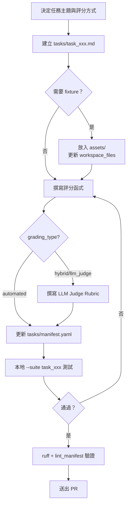
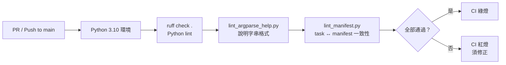

# PinchBench 開發者上手指南

> 版本：2.0.0-rc1｜更新日期：2026-04-21

---

## 目錄

1. [Prerequisites](#1-prerequisites)
2. [本地開發 Workflow](#2-本地開發-workflow)
3. [新增任務的完整流程](#3-新增任務的完整流程)
4. [測試策略](#4-測試策略)
5. [Debugging 技巧](#5-debugging-技巧)
6. [Contribution Workflow](#6-contribution-workflow)

---

## 1. Prerequisites

### Python 3.10+

```bash
python3 --version   # 確認版本 ≥ 3.10
```

### uv 套件管理器

[uv](https://docs.astral.sh/uv/) 是官方套件管理與腳本執行工具（`pyproject.toml` 指定）。

```bash
curl -LsSf https://astral.sh/uv/install.sh | sh
```

### OpenClaw（External Dependency）

OpenClaw **不包含**在此 repo 中，是必要的 external dependency，PinchBench 靠它執行所有 agent 任務。

- 官方 GitHub：[github.com/openclaw/openclaw](https://github.com/openclaw/openclaw)
- 安裝後確認 `openclaw` 在 `PATH` 中可執行

若 CLI 位於非標準路徑，設定：

```bash
export OPENCLAW_PATH=/path/to/openclaw
```

### 必要 API Keys

| 變數 | 用途 | 何時必要 |
|------|------|----------|
| `OPENROUTER_API_KEY` | 模型路由（預設 judge 後端） | 使用 OpenRouter 模型時 |
| `ANTHROPIC_API_KEY` | 直接呼叫 Anthropic API | `--judge anthropic/...` 時 |
| `OPENAI_API_KEY` | 直接呼叫 OpenAI API | `--judge openai/...` 時 |
| `PINCHBENCH_TOKEN` | 上傳結果到排行榜 | 上傳到 pinchbench.com 時 |

### 選用工具（GWS 任務）

category 為 `gws` 或 `github` 的任務需額外安裝（`lib_fws.py:25` 自動偵測）：

```bash
npm install -g @juppytt/fws   # Google Workspace mock server
```

---

## 2. 本地開發 Workflow

1. **Clone repo**

   ```bash
   git clone https://github.com/pinchbench/skill.git
   cd skill
   ```

2. **安裝依賴**

   ```bash
   uv sync              # 主要依賴（pyyaml、fabric、paramiko）
   uv sync --extra dev  # 加上開發依賴（pytest、ruff、black）
   ```

3. **設定環境變數**（建立 `.env` 並 source，切勿 commit）

   ```bash
   export OPENROUTER_API_KEY=sk-or-xxxxxxx
   export PINCHBENCH_TOKEN=pbk_xxxxxxx      # 可選，上傳排行榜用
   source .env
   ```

4. **一次性 Token 註冊**（首次上傳排行榜前）

   ```bash
   ./scripts/run.sh --register
   # Token 儲存於 scripts/.pinchbench/config.json
   ```

5. **執行第一個 benchmark**

   ```bash
   # 單一任務（推薦新手先試）
   ./scripts/run.sh --model openrouter/anthropic/claude-sonnet-4 \
       --suite task_calendar --no-upload

   # 只跑自動評分任務（不需要 LLM judge，速度快）
   ./scripts/run.sh --model openrouter/anthropic/claude-sonnet-4 \
       --suite automated-only --no-upload
   ```

6. **解讀結果**

   執行後輸出在 `results/` 目錄：

   ```
   results/
   ├── 0001_anthropic--claude-sonnet-4.json   # 完整結果（含 summary.score）
   └── 0001_transcripts/
       └── task_calendar.jsonl                # agent 對話 transcript
   ```

   主要欄位：`summary.score`（整體分）、`tasks[].breakdown`（各 criterion 明細）、`summary.cost_usd`。

---

## 3. 新增任務的完整流程

新增任務是 PinchBench **最重要的貢獻路徑**。



### 步驟一：建立任務檔案

新建 `tasks/task_my_new_task.md`，參照 `tasks/TASK_TEMPLATE.md`：

```markdown
---
id: task_my_new_task          # 必須與檔名（去掉 .md）完全一致
name: My New Task
category: productivity
grading_type: automated       # automated | llm_judge | hybrid
timeout_seconds: 120
workspace_files: []
---

## Prompt
（給 agent 的完整指令）

## Expected Behavior
（說明可接受的做法與替代方案）

## Grading Criteria
- [ ] 條件一
- [ ] 條件二

## Automated Checks
```python
def grade(transcript: list, workspace_path: str) -> dict:
    from pathlib import Path
    scores = {}
    workspace = Path(workspace_path)
    scores["file_created"] = 1.0 if (workspace / "output.txt").exists() else 0.0
    return scores
```
```

**Frontmatter 欄位一覽：**

| 欄位 | 必填 | 說明 |
|------|------|------|
| `id` | 是 | 與檔名一致 |
| `grading_type` | 是 | `automated` / `llm_judge` / `hybrid` |
| `timeout_seconds` | 是 | 建議 60–300 |
| `grading_weights` | hybrid 才填 | `{automated: 0.4, llm_judge: 0.6}` |
| `prerequisites` | 否 | 如 `[npm:@juppytt/fws]` |

### 步驟二：撰寫評分函式

`grade()` 函式規格（參見 `tasks/TASK_TEMPLATE.md:87`）：

- **參數**：`transcript`（JSONL 事件列表）、`workspace_path`（字串）
- **回傳**：`{"criterion_key": 0.0~1.0, ...}`，最終分數為所有項目的**算術平均**
- **限制**：只能用標準函式庫 + `pathlib`；必須容錯（不拋例外）

Transcript 事件結構：

```python
# 取出工具呼叫
for event in transcript:
    if event.get("type") != "message":
        continue
    msg = event.get("message", {})
    if msg.get("role") == "assistant":
        for item in msg.get("content", []):
            if item.get("type") == "toolCall":
                if item.get("name") == "create_file":
                    scores["used_create_file"] = 1.0
```

### 步驟三：新增 Fixture（若需要）

將素材放在 `assets/`，frontmatter 中宣告：

```yaml
workspace_files:
  - source: assets/csvs/my_data.csv   # 相對 repo 根目錄
    dest: data.csv                     # 相對任務工作區
```

### 步驟四：更新 Manifest

在 `tasks/manifest.yaml` 末尾加上任務 ID：

```yaml
tasks:
  - task_calendar
  # ...
  - task_my_new_task    # ← 新增
```

CI 的 `scripts/lint_manifest.py` 會雙向驗證 `.md` 與 manifest 的對應關係，不符時 CI 失敗。

### 步驟五：測試任務

```bash
./scripts/run.sh --model openrouter/anthropic/claude-sonnet-4 \
    --suite task_my_new_task --no-upload --verbose
```

---

## 4. 測試策略

### 現有單元測試

```
tests/
├── test_lib_grading.py   # 評分引擎：分數正規化、hybrid 加權計算
└── test_lib_trend.py     # 趨勢分析邏輯
```

```bash
uv run pytest tests/ -v
uv run pytest tests/ --cov=scripts --cov-report=term-missing
```

關鍵測試案例（`tests/test_lib_grading.py:17`）：

- `test_normalize_judge_response_*`：當 judge 把分數加總（>1）時，自動修正為平均值
- `test_hybrid_score_uses_normalized_judge_total`：驗證 hybrid 模式的加權合併計算

### 測試新任務的評分函式

```python
# tests/test_my_task.py
import sys; sys.path.insert(0, "scripts")
from lib_grading import run_automated_grading
from lib_tasks import TaskLoader

task = TaskLoader("tasks").load_task("task_my_new_task")
mock_transcript = []   # 可從 results/*_transcripts/*.jsonl 取得真實資料
result = run_automated_grading(task, mock_transcript, workspace_path="/tmp/test_ws")
print(result)
```

### --suite 的用法（`benchmark.py:282`）

| 值 | 說明 |
|----|------|
| `all`（預設） | 執行 manifest 所有任務 |
| `automated-only` | 只執行 `grading_type: automated` 任務 |
| `task_a,task_b` | 逗號分隔的任務 ID 清單 |

---

## 5. Debugging 技巧

### --verbose Flag（`benchmark.py:242`）

`-v` / `--verbose` 輸出內容：transcript 詳情、工作區檔案清單、各 criterion 分數、OpenClaw CLI 完整輸出。

```bash
./scripts/run.sh --model openrouter/anthropic/claude-sonnet-4 \
    --suite task_calendar --verbose --no-upload
```

### Transcript 位置

| 位置 | 說明 |
|------|------|
| `results/{run_id}_transcripts/{task_id}.jsonl` | 執行後的永久 archive |
| `~/.openclaw/agents/{agent_id}/sessions/` | OpenClaw 原始 session 目錄 |

```bash
cat results/0001_transcripts/task_calendar.jsonl | python3 -m json.tool | head -100
```

### benchmark.log 位置

固定寫入**執行 `run.sh` 的工作目錄**下（即 repo 根目錄），`benchmark.py:44`。Log level 硬編碼為 INFO，無法透過環境變數調整。

```bash
tail -f benchmark.log
grep ERROR benchmark.log
```

### 常見踩坑

| 問題 | 原因 | 解法 |
|------|------|------|
| `FileNotFoundError: 'openclaw'` | openclaw 不在 PATH | 設定 `OPENCLAW_PATH` 環境變數 |
| Transcript 找不到 | agent 目錄未初始化 | 確認 `~/.openclaw/agents/` 已建立 |
| fws 任務失敗 | fws 未安裝或不在 PATH | `npm install -g @juppytt/fws` |
| 所有任務 0 分 | judge API key 無效 | 確認 `OPENROUTER_API_KEY` 正確 |
| manifest lint CI 失敗 | task 未加入 manifest | 在 `tasks/manifest.yaml` 末尾新增任務 ID |
| Run ID 推算錯誤 ⚠️ 未驗證 | `/tmp/pinchbench/` 有非數字目錄 | `rm -rf /tmp/pinchbench/` |

---

## 6. Contribution Workflow

### 分支策略

| 類型 | 命名規則 | 範例 |
|------|----------|------|
| 新任務 | `feat/task-{name}` | `feat/task-code-review` |
| 功能改進 | `feat/{description}` | `feat/trend-analysis` |
| Bug 修復 | `fix/{description}` | `fix/grading-normalization` |

`main` 分支直接 push 僅限維護者。

### CI Checks（`.github/workflows/lint.yml`）

觸發條件：所有 PR 及 push to main。



**本地預先執行 CI 檢查：**

```bash
# 安裝 pre-commit hooks（建議，hooks 定義於 .pre-commit-config.yaml）
pip install pre-commit && pre-commit install

# 手動執行
uv run ruff check .
uv run ruff check --fix .                     # 自動修正
uv run python scripts/lint_argparse_help.py
uv run python scripts/lint_manifest.py
```

### PR 格式

**標題：**

```
feat(task): add task_code_review for multi-file code review
fix(grading): normalize judge score when total exceeds 1.0
```

**Description Checklist：**

```markdown
- [ ] YAML frontmatter 完整，id 與檔名一致
- [ ] tasks/manifest.yaml 已更新
- [ ] 評分函式只使用標準函式庫
- [ ] Fixture 檔案放在 assets/ 並已在 frontmatter 引用
- [ ] 本地 ruff + lint_manifest 全部通過
- [ ] --suite task_xxx --verbose 執行結果合理
```

**Release 流程**（僅維護者）：建立 GitHub Release Tag 後，`release.yml` 自動更新 `BENCHMARK_VERSION` 並 commit 回 main。

---

## 附錄：快速參考

| 路徑 / 指令 | 說明 |
|------------|------|
| `results/{run_id}_{slug}.json` | 完整結果 JSON |
| `results/{run_id}_transcripts/{task_id}.jsonl` | Transcript archive |
| `benchmark.log` | 執行日誌（repo 根目錄） |
| `/tmp/pinchbench/{run_id}/agent_workspace/` | 任務執行工作區 |
| `scripts/.pinchbench/config.json` | API Token 儲存位置 |
| `tasks/manifest.yaml` | 任務有序列表（唯一真實來源） |
| `tasks/TASK_TEMPLATE.md` | 任務撰寫完整模板 |
| `scripts/benchmark.py` | 主入口（927 行） |
| `scripts/lib_grading.py` | 評分引擎（717 行） |
| `scripts/lib_agent.py` | OpenClaw 互動層（1242 行） |
